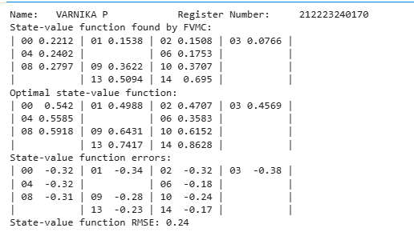
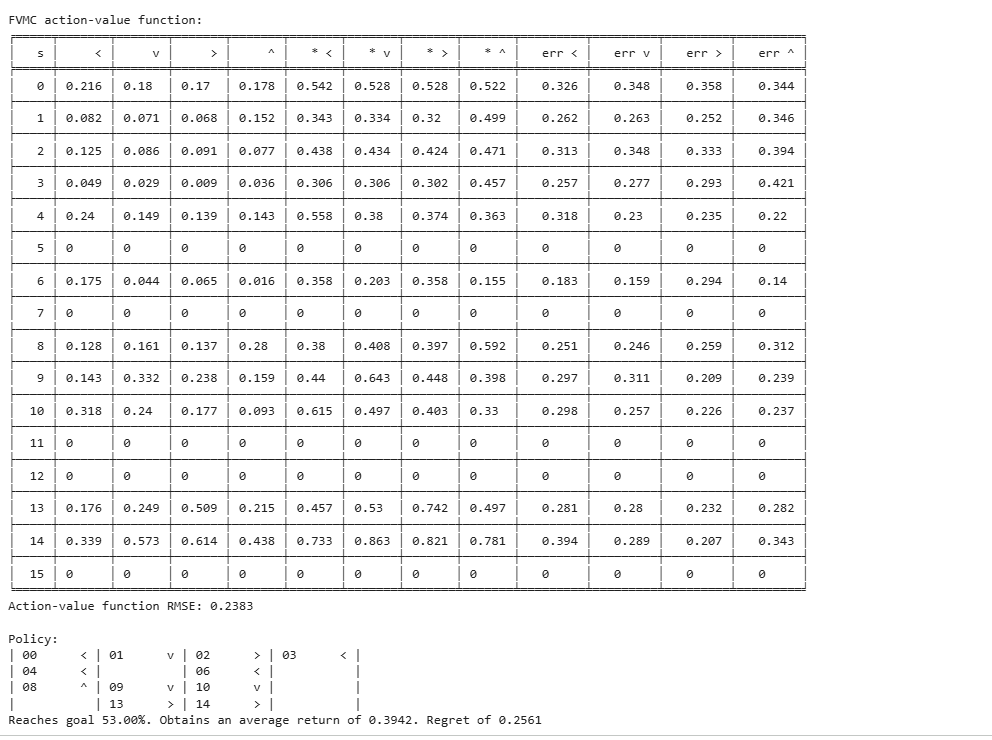
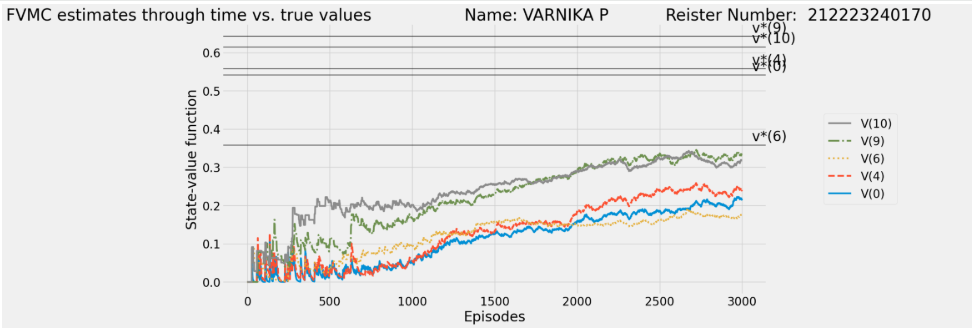
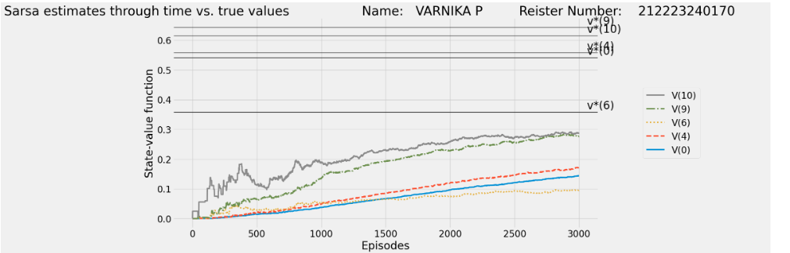

# SARSA Learning Algorithm

### Name: VARNIKA.P
### Register Number: 212223240170
## AIM
To develop a Python program to find the optimal policy for a Reinforcement Learning (RL) environment using the SARSA Learning algorithm and compare the obtained state-action values with the Monte Carlo method.
## PROBLEM STATEMENT
The problem involves training an intelligent agent to interact with an environment and learn the best actions to take in each state in order to maximize cumulative rewards. The agent learns using the SARSA (State–Action–Reward–State–Action) algorithm, which updates the Q-values based on the current action and the next selected action.
## SARSA LEARNING ALGORITHM

1. Initialize the Q-table with default values for all state-action pairs.

2. Set the learning rate, discount factor, exploration rate, and number of episodes.

3. Start the episode from the initial state.

4. Choose an action using the epsilon-greedy policy.

5. Perform the selected action in the environment.

6. Observe the reward and the next state.

7. Choose the next action from the next state using the epsilon-greedy policy.

8. Update the Q-value for the current state and action.

9. Update the current state and action with the next state and next action.

10. Repeat the process until the terminal state is reached.

11. Reduce the exploration rate after each episode if decay is used.

12. Return the learned Q-table and optimal policy after training.

## SARSA LEARNING FUNCTION
```python
def sarsa(env,
          gamma=1.0,
          init_alpha=0.5,
          min_alpha=0.01,
          alpha_decay_ratio=0.5,
          init_epsilon=1.0,
          min_epsilon=0.1,
          epsilon_decay_ratio=0.9,
          n_episodes=3000):
    nS, nA = env.observation_space.n, env.action_space.n
    pi_track = []
    Q = np.zeros((nS, nA), dtype=np.float64)
    Q_track = np.zeros((n_episodes, nS, nA), dtype=np.float64)

    select_action = lambda state, Q, epsilon: (
    np.argmax(Q[state])
    if np.random.random() > epsilon
    else np.random.randint(len(Q[state]))
    )
    alphas = decay_schedule(
    init_alpha,
    min_alpha,
    alpha_decay_ratio,
    n_episodes
    )
    epsilons = decay_schedule(
    init_epsilon,
    min_epsilon,
    epsilon_decay_ratio,
    n_episodes
    )
    for e in tqdm(range(n_episodes), leave=False):
        state, done = env.reset(), False
        action = select_action(state, Q, epsilons[e])
        while not done:
            next_state, reward, done, _ = env.step(action)
            next_action = select_action(
                next_state,
                Q,
                epsilons[e]
            )
            td_target = reward + gamma * Q[next_state][next_action] * (not done)
            td_error = td_target - Q[state][action]
            Q[state][action] = Q[state][action] + alphas[e] * td_error
            state, action = next_state, next_action
        Q_track[e] = Q.copy()
        pi_track.append(np.argmax(Q, axis=1))

    V = np.max(Q, axis=1)
    pi = lambda s: {
        s: a for s, a in enumerate(np.argmax(Q, axis=1))
    }[s]

    return Q, V, pi, Q_track, pi_track
```
## OUTPUT:
Mention the optimal policy, optimal value function , success rate for the optimal policy.
### Value function:

### Optimal policy and success rate:

### Plot comparing the state value functions of Monte Carlo method and SARSA learning.


## RESULT:
Thus, the SARSA Learning algorithm was implemented successfully, and the optimal policy for the RL environment was obtained. The learned Q-values were analyzed and compared with the Monte Carlo method.
